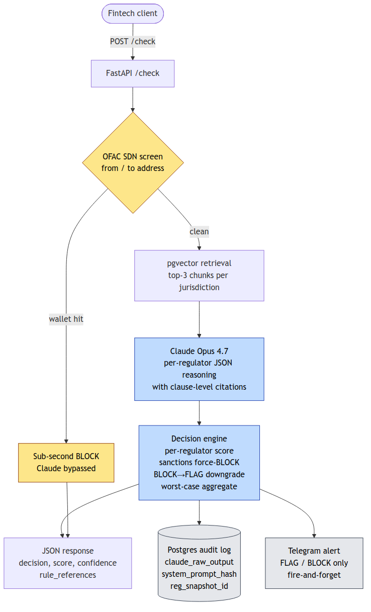

# DEFAI ComplianceOS

> **Existing tools tell you what to flag. ComplianceOS tells you why.**
>
> Clause-level citations from VARA, MAS, and FCA on every transaction decision —
> the exact rule text a compliance officer puts in a regulatory filing.


## Try it

```bash
curl -X POST http://localhost:8000/check \
  -H "Content-Type: application/json" \
  -d '{
    "transaction_id": "demo_003",
    "amount": 50000,
    "currency": "USDT",
    "sender_country": "IR",
    "receiver_country": "UK",
    "jurisdiction": "FCA",
    "transfer_count_24h": 1
  }'
```

Returns a BLOCK decision with per-regulator scores (VARA/MAS/FCA) and
rule_references populated with verbatim regulatory quotes — see
The wedge below.

## Who it's for

Built for Series A–B digital asset funds operating across UAE, Singapore,
and UK. Your compliance stack was built for one regulator. DEFAI ComplianceOS
screens every transaction against VARA, MAS, and FCA simultaneously and
returns per-regulator decisions with clause-level citations in a single API
call: sub-second on OFAC SDN hits, 15–25s on full Opus 4.7 reasoning over
retrieved regulatory context.

## Why now — April 2026

VARA Phase 2 enforcement is live. MiCA's transition window closed in
December 2025 and EU crypto firms are now fully in scope. The FCA's
financial promotion regime for cryptoassets has been in force for over
two years and enforcement actions are accelerating. A fund operating
UAE ↔ Singapore ↔ UK in 2026 is reconciling three hardening regimes on
every transfer — and paying a six-figure annual seat fee per
jurisdiction for tools that score wallets but don't cite rules.

## What it does

- Per-regulator PASS/FLAG/BLOCK with clause-level citations (VARA, MAS, FCA, FATF)
- OFAC SDN wallet screening before Claude is called (sub-second bypass on hit)
- Full audit trail: `claude_raw_output`, content-hashed regulatory snapshot ID, system-prompt hash, override logging
- Async FastAPI, PostgreSQL audit log, fire-and-forget alert delivery off the request path
- `/audit`, `/trace/{id}`, `/health`, Swagger at `/docs`

**Latency:** OFAC SDN bypass returns in under a second. Full Opus 4.7 reasoning runs 15–25s including per-jurisdiction retrieval and structured citation generation.

## The wedge: clause-level citations

Every FLAG or BLOCK decision carries one or more citation objects. Each citation names a specific regulatory clause, quotes it verbatim, and maps a transaction field to the element of the rule it satisfies. Example from a Scenario 3 (Iran → UK, $50k USDT) run:

```json
{
  "jurisdiction": "FCA",
  "instrument": "Financial Crime Guide (FCG)",
  "rule_id": "FCG 7.2.3",
  "effective_date": "2024-04-30",
  "quote_excerpt": "Firms must ensure that their systems and controls are adequate to identify transactions with individuals or entities in jurisdictions subject to UK financial sanctions.",
  "mapping": "This transaction triggers FCG 7.2.3 because sender_country=IR is a UK-sanctioned jurisdiction under the Russia (Sanctions) (EU Exit) Regulations 2019 and equivalent Iran regimes."
}
```

This is what a compliance officer would otherwise spend an hour drafting by hand against the rulebook PDF — and what they'd get fined for getting wrong.

## Architecture



Supported jurisdictions: **VARA, MAS, FCA, FATF**.

## Demo scenarios

| # | Input | Decision | Score |
|---|---|---|---|
| 1 | SG → UK, $2,500 USD, 1 transfer / 24h | **PASS** | low |
| 2 | AE → SG, 7 × $9,800 USD / 24h (structuring) | **FLAG** | mid |
| 3 | IR → UK, $50,000 USDT (sanctions) | **BLOCK** | high |
| 4 | US → US, $1,000 USDT, OFAC SDN wallet `149w62rY…StKeq8C` | **BLOCK** | 100 |

Scenario 4 bypasses Claude entirely — the OFAC SDN match returns
`decision=BLOCK, score=100, confidence=1.0` with the matched SDN entry name
in the `reason` field.

## How to run

```bash
# 1.
cp .env.example .env    # add ANTHROPIC_API_KEY (TELEGRAM_* vars are optional — leave blank to skip alerts)

# 2.
docker compose up -d

# 3.
pip install -r requirements.txt

# 4.
python3 -m ingest.loader

# 5.
python3 main.py

# 6.
python3 tests/scenarios.py
```

## Endpoints

- `POST /check` — score a transaction against VARA, MAS, and FCA; returns per-regulator decisions + aggregate PASS/FLAG/BLOCK with clause-level citations
- `GET /audit` — last 20 decisions (trace_id, decision, score, confidence, reason, rule_references, processing_ms, created_at)
- `GET /trace/{transaction_id}` — full audit row including Claude's raw reasoning and regulatory snapshot ID
- `GET /health` — liveness probe + regulatory_docs_loaded + transactions_processed
- `GET /docs` — Swagger UI

## Tech stack

- Claude Opus 4.7 — AML/CFT reasoning engine
- FastAPI + Python 3.12 — async REST API
- PostgreSQL 16 + pgvector — vector store + audit log
- sentence-transformers all-MiniLM-L6-v2 — local embeddings
- python-telegram-bot v22 — real-time FLAG/BLOCK alerts
- OFAC SDN XML — daily-refreshed crypto wallet screening

## Why Opus 4.7

The value isn't classification — a rules engine can classify. The value is
the reasoning chain: Opus reads the actual regulatory text, identifies
which clause applies per regulator, and explains why in language a
compliance officer can use in a regulatory filing. That explanation is the
audit trail.

## Judging criteria

- **Impact (30%)** — Series A–B digital asset funds operating across UAE/SG/UK pay six-figure annual fees per jurisdiction for siloed compliance tooling. This system returns per-regulator decisions in one call.
- **Demo (25%)** — Four live scenarios: PASS, FLAG, BLOCK, OFAC-BLOCK. Telegram alert fires in real time. Full audit trail queryable via `GET /trace/{id}`.
- **Opus 4.7 use (25%)** — RAG over VARA/MAS/FCA/FATF regulatory PDFs. Per-regulator JSON reasoning with verbatim clause quotes and transaction-field-to-rule-element mapping. Degraded fallback on API failure.
- **Depth (20%)** — Float confidence calibration with derived label. Two hard overrides in the decision engine: (a) sanctioned-jurisdiction force-BLOCK (any transfer with sender or receiver in the sanctions set is forced to aggregate BLOCK with score floor 85 — same pattern as OFAC SDN wallet screening, at the country level); (b) jurisdiction-aware BLOCK→FLAG downgrade (Claude's per-regulator BLOCK is only honored when score≥85 OR a sanctioned jurisdiction is involved). Every override writes `override_applied=true` and a reason string into the audit row. OFAC SDN wallet pre-screen bypasses Claude entirely on hit. Content-hashed regulatory snapshot ID per decision. Structured audit log with `claude_raw_output` preserved verbatim.
